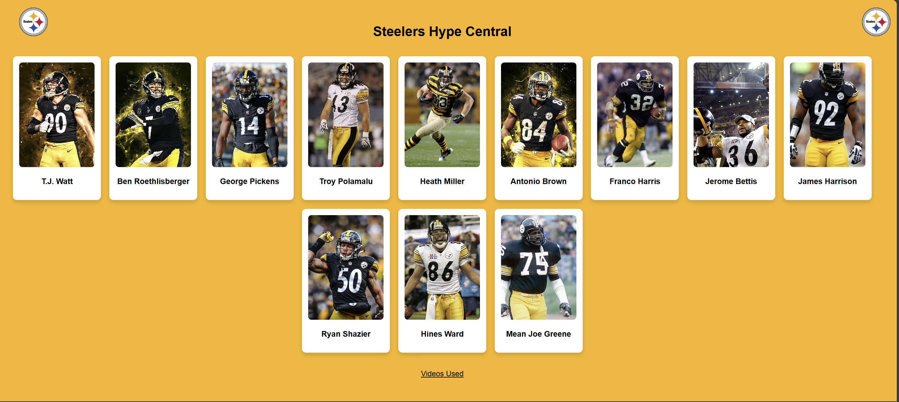
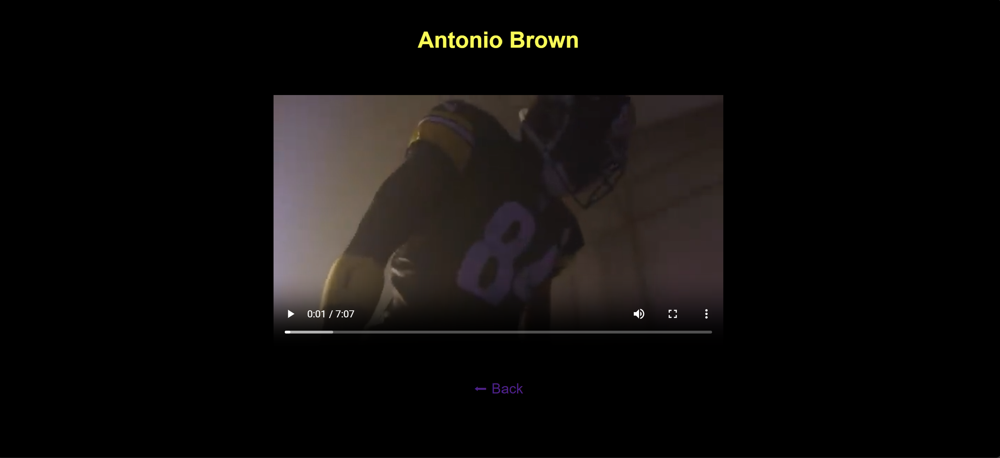

# Steelers Hype App

## 1) Executive Summary

**Problem:** The Pittsburgh Steelers fanbase is one of the most passionate and die-hard fandoms in not just the NFL but across all the major sports leagues. Steelers Nation takes pride in their players, and those that especially rise to the top hold a special place in all Steelers' fans hearts. These players - both past and present - have a connection to each and every Yinzer because of the massive importance that the Steelers have for their fans. With such a rich history, there are players across generations that have made an impact on the Steel-City. However, multimedia content surronding these great Steelers players are scattered across the web, making it difficult for enthusiastic Steelers fans to find exactly what they are looking for when they want to be hyped up for their team or to reminisnce on the good-ole days of Steeler football.

**Solution:** Steelers Hype Central is an app that is a central hub containing players who date back to the glory years of the 1970s all the way to the current Steelers team under Mike Tomlin. This app allows users to take a look at each of these players, like the great Ben Roethlisberger and Hall of Famer Mean Joe Greene, and be in awe of their presence through the screen as they view their greatness in a Steelers uniform. By clicking on a player, the user is directed to a highlight, tribute, or hype video about that player that is surely guaranteed to fire the user up. Even if the user isn't a Steelers fan, this app will likely increase their appreciation and respect for such a historic and proud organization that is the Pittsburgh Steelers. 


## 2) System Overview

**Course Concepts:** Flask API, Containerization with Docker, Cloud Deployment with Azure App Service

**Architecture Diagram:**


**Data/Models/Services:**
The app uses information of 12 former and current Pittsburgh Steelers Players. Each player record contains:
- ID 
- Name
- Image Path (png, webp, JPEG)
- Video Path (mp4)

Licensing: the application includes a LICENSE file for project code (MIT License). All videos pulled for the project are credited at the bottom of the app under "Videos Used" 


## 3) How to Run (Local)

**Docker**
```bash
# build
docker build -t steelers-hype-app:latest .

# run
docker run --rm -p 8080:8080 steelers-hype-app:latest

# health check 
curl http://localhost:8080/health
```
This will serve the app at: http://localhost:8080 


## 4) Design Decisions

### **Why this Concept?**  
I decided to create a Flask app with Docker containerization because it is a simple yet foundational concept that could carry out my vision of my Steelers app. I chose Flask over FastAPI despite FlaskAPI being a little faster and more modern because I believed Flask was suitable enough for the basic framework of my project. As for the container, I chose Docker over Appainter because Docker seemed easier for general development and deployment tasks (which again aligned with the simple strucutre of my app) while Appainter is direct more towards higher performance computing with a need for security. Finally, I also considered to employ blob storage for my app, but decided against it because I wanted the app to be more defined (by separating the players that users can click on) rather than just having one place to store pictures and videos.

### **Tradeoffs:** 
- **Performance:** Flask doesn't have the fastest structure, but high-powered performance was not a critical issue for the app. Docker adds on an extra performance overhead but makes it easy to make apps contained and portable.
- **Cost:** Deploying the app to the cloud using something like Azure App Service establishes runtime costs, which can be managed by student credit and the ability to stop the app.
- **Complexity:** Using Docker to containerize the app adds complexity with structures like Dockerfile and image builds, but makes it worthwile due to its ability to make the app reproducible. Overall, the app has a simple framework, which might make user experience less than optimal, but its simplicity allows for enhancement of the app in the future to make it more complex and user-friendly.
- **Maintainability:** This Dockerized app will make it easy to maintain long-term since updates won't break the app environment. If I wanted to make changes to the app, however, I would have to rebuild and push a new Docker image.

### **Security/Privacy**
- **Secrets Management:** The Steelers Hype App does not use any secrets or API keys. If secrets were needed then they would be stored in the .env file. 
- **Input Validation:** This app does not use any user input.
- **PII Handling:** No personal information is collected by the app.

### **Ops:**
- **Logs/Metrics:** Gunicorn in Docker automatically creates server logs which is extremely useful for debugging both locally and on the cloud (logs can be seen in Azure App Service). No advanced metrics are used for this app.
- **Scaling:** The Docker container holding the app can be horizontally scaled (adding more nodes to handle an increase workload across multiple machines), but there is no need for that here because the app is simply designed for a single-instance.
- **Known Limitations:** The app is quite simple, like how each player only has one video attached to them and there are only 12 players total. The app is also public with little concern for security threats.


## 5) Results and Evaluation

**Output:** The Steelers Hype App generates an interface containing 12 Steelers players that can be browsed by the user. The background of the app is yellow and there are 2 Steelers logos in the top corners. When a user hovers over a player, their card will get bigger, and when they are clicked on, it will redirect the user to an mp4 highlight or tribute video for that player (on a black background). Here are two screenshots:


This picutre is zoomed out just so you can see all the players and the "Videos Used" link at the bottom. When you open the app there will be 6 players on the top row and 6 players on the bottom row.



**Performance Notes:**
- App runs on Python 3.13 Docker image
- Gunicorn (version 21.2.0) boots up quickly and handles incoming requests 
- Static assets (images and videos) load quickly for Docker use

**Resource Footprint:**
- Docker Image Size = 710 MB
- Runtime memory is around 30 MB for local use

**Validation/Tests**
- Health Check Enpoint: returns { "status": "ok" } after using "/health"; works both on the localhost and the cloud url from Azure
- Testing: 
    - Verified each player route loads correctly
    - Ensured the each player image and video is present and are assigned to the correct player
    - Added Steelers logos to the top corners; repeatedly tested to make sure they were aligned.
    - Made sure the app still worked properly even when changes were made (rebuild with Docker)
- **Main Conflict**:
    - My video file for Ben Roethlisberger was initially too big to be pushed to my GitHub repo. Despite the video being fully fine within my app, I was unable to push the videos folder since it was too large. I had to fix this by replacing the video with a smaller one, but pushing to GitHub still resulted in an error. As a solution, I cleared my GitHub commit history to get rid of the big video file, and then pushed everything again, which successfully got the images and videos into my repo.


## 6) What's Next

- Adding a **real database** to store player data rather than in a coded Python list. I can use MongoDB to accomplish this, and the database will make it easier to add more players, images, and videos to the app. Additionally, I will add more images, videos, and text for each player so there is more information and media surronding them. I want each player not just to have one video, but rather a plethera of images, clips, and facts about their lives and football careers. 
- Implementing **search and filter categories**. After adding more and more players, I can enhance the user experience by making search and filter tools so the user can find any Steelers player or group of players they want to look into. Sorting examples may include filtering by "offense," "Hall of Fame", or "present" players. 
- Improving the **user interface**. Right now, the app interface is pretty basic. I can work to upgrade the UI by making the header of the app more distinct and engaging, adding more images that are appealing to Steelers fans, and making each player profile more aesthetic (so it's not just a plain black background)
- Adding **more content**. Right now the app consists of solely Steelers players. I would like to also add coaches, significant games (like Super Bowls), and other important figures and moments within the Steelers organization. 


## 7) Links

**Github Repo**: https://github.com/H-Miller83/steelers-hype 

**Public Cloud App:** https://steelers-hype-app-fcethdhjereahfes.westus3-01.azurewebsites.net/ 


